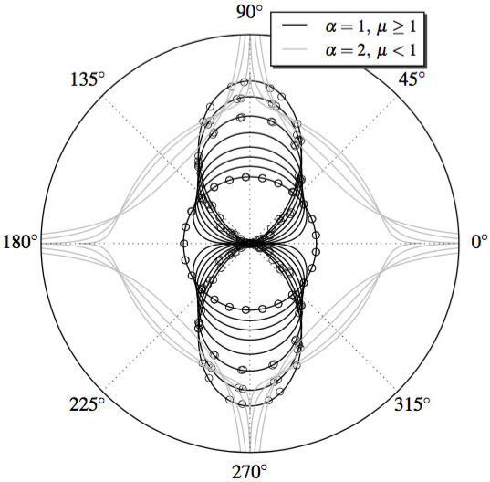

Today I just received an awesome message. I have been contemplated with a travel grant from IEEE APS to present my paper at the IEEE APS/URSI conference which will be held in Puerto Rico! :)

My paper is about a derivation of a new envelope-phase joint density function for the exponentiated-Weibull fading in free space optical communication channels.

Since this is a work in progress, there is a lot to be investigated yet<a href="#fn1" id="ref1">1</a>! For instance, we did not derive a closed-form expression for the phase marginal pdf (the integral is pretty scary :x). However, I've done it numerically. And it looks like this:

Basically, this shows that the phase is uniform distributed for &#956 = 1 and it rapidly degenerates (i.e., becomes deterministic) for &#956 << 1. It also degenerates in case &#956 >> 1, but a bit slowly.

With this phase knowledge one can better characterize the free space optical channel subject to turbulence and compute high order statistics such as the phase crossing rate. Also, now, one can analyse the effect of the phase noise on the transmitted signal.

If you would like to collaborate, please get in touch!

PS: I just can't wait to be back to US even for just a week (:

1. Hopefully I will be selected to GSoC, and hence I won't have time to tackle that til September.<a href="#ref1" title="Jump back to footnote 1 in the text.">↩</a>
