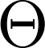
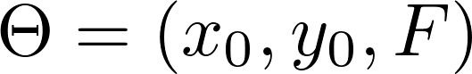
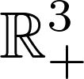
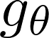
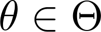
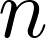

Hi all!

First things first; the following links point out to the pull requests that I worked on
during the course of my GSoC project

<a href="https://github.com/astropy/photutils/pull/367">#367: Create PSF subpackage</a>
<a href="https://github.com/astropy/photutils/pull/369">#369: Add an implementation of daophot GROUP functionality</a>
<a href="https://github.com/astropy/photutils/pull/376">#376: Add a way to get params uncertainties in psf_photometry</a>
<a href="https://github.com/astropy/photutils/pull/379">#379: findstars oop interface</a>
<a href="https://github.com/astropy/photutils/pull/385">#385: PSF Photometry in Crowded Fields</a>
<a href="https://github.com/astropy/photutils/pull/404">#404: [DOC]: Narrative docs for PSF Photometry</a>
<a href="https://github.com/astropy/photutils-datasets/pull/5">#5: Notebook for psf-photometry in crowded fields</a>

My project was entitled "Implement Point Spread Function (PSF) photometry for
fitting several overlapping objects at once". The basic question is, given an
astronomical image, "How to estimate the flux and the positions of each star
when there exist overlap between them?".

To make our lives easier, we broke this question in smaller ones, for instance,
"Which stars are overlapping?". To answer this question,
we implemented (<a href="https://github.com/astropy/photutils/pull/369">#369</a>
) the GROUP algorithm proposed by Stetson (1987) which is used
in the IRAF/DAOPHOT software.

<i>Read the following paragraphs if you are interested in some interesting
facts that happens behind the scenes
</i>

<i> BEGIN Behind the Scenes </i>
It is assumed that the point spread function (which is the optical system's
impulsive response) has a known model with unknown parameters (and we would
like to estimate them). Mathematically, assume that
 is the parameter space (i.e. the space
of possible values that the parameters can assume).

Usually, the parameters are the center position and the flux of the star.
In this case,  is reduced to
. As the parameters are
positive real-valued numbers and if we would like to fit only one star at at time,
the optmization algorithm will search for solutions over the  space.

If  is the PSF model (for example a
<a href="http://photutils.readthedocs.io/en/latest/api/photutils.psf.IntegratedGaussianPRF.html#photutils.psf.IntegratedGaussianPRF.param_names">Gaussian model</a>), , then
the model for a group of  stars is given as

Note that, the space of possible solutions is not the positive part of the 3D space anymore, 
it is the positive part of the 3*n D space :O

Lucky us, Scipy scientists already implemented awesome optimization algorithms
and some of then are encapsulated in <a href="http://docs.astropy.org/en/stable/_modules/astropy/modeling/fitting.html"> astropy.modeling </a> :)
<i> END Behind the Scenes </i> 

After finding the groups of stars, the algorithm proceeds to fit the stars in
each group simultaneously. Right after fitting a given group, that group is subtract
from the original image (forming a "residual image").

All these steps are enclosed in <a href="https://github.com/astropy/photutils/pull/385""> DAOPhotPSFPhotometry </a> class.

Please, see this notebook <a href="https://github.com/astropy/photutils-datasets/pull/5"> here </a> for details. 
