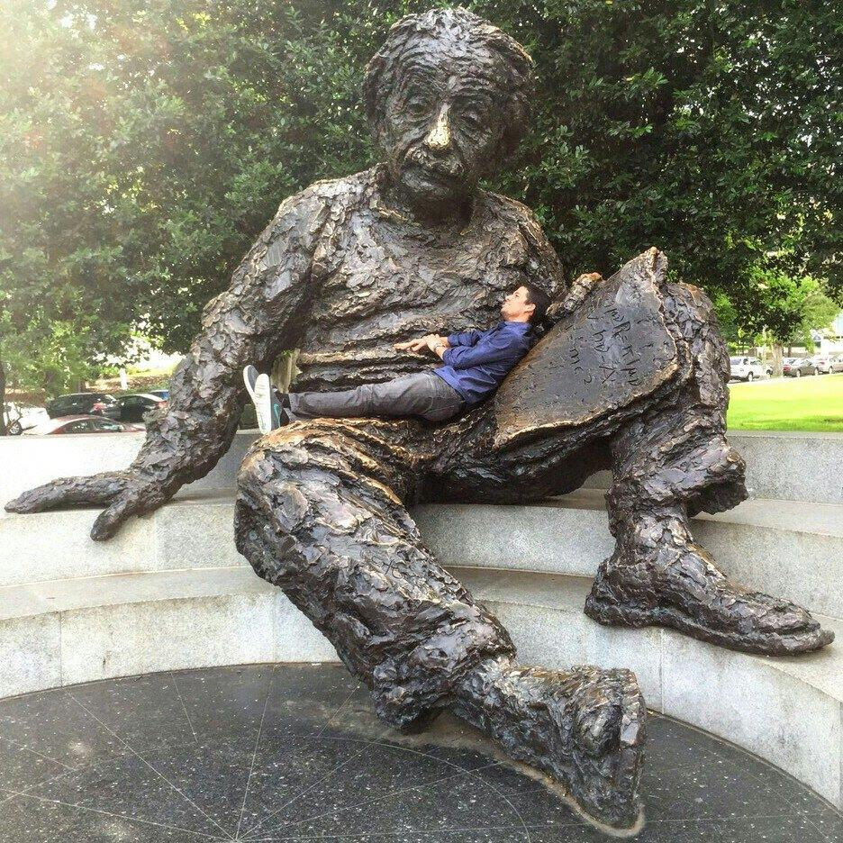

Hi, I'm Zé. I'm an undergraduate student pursing Electrical Engineering at the Federal University of Campina Grande, Brazil. Since my first year in college, I've been with the Institute for Advanced Studies in Communications as an undergraduate research assistant working with image processing and communications.

In the Summer of 2015, I worked as an undergraduate guest researcher with Marcelo Davanço, in the Nanofabrication Research Group, National Institute of Standards and Technology, USA. In that opportunity, I wrote MATLAB code for single molecule localization microscopy and fluorescense localization imaging microscopy.

In the Spring of 2016, I held a teaching assistant scholarship for the course of Probability and Statistics for Electrical Engineering and Computer Science.

During the Summer of 2016, I was a student software developer for the Astropy Project under the Google Summer of Code program. In that opportunity, I was mentored by Hans Moritz Gunther, Brigitta Sipocz, and Erik Tollerud on a project which involved development of Python code for point spread function photometry.

Besides loving math, physics, and programming, I also enjoy music, coffee, chess, running, and soccer.

Beginning 2017, I started as an intern for the Kepler/K2 Guest Observer Office at NASA Ames working on data analysis problems together with Geert Barentsen.

